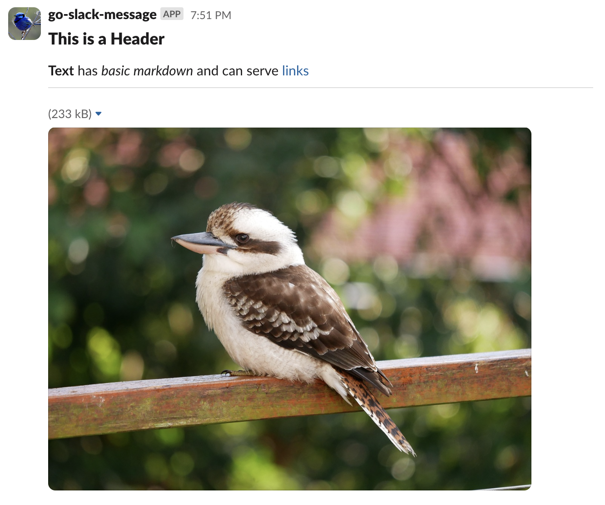
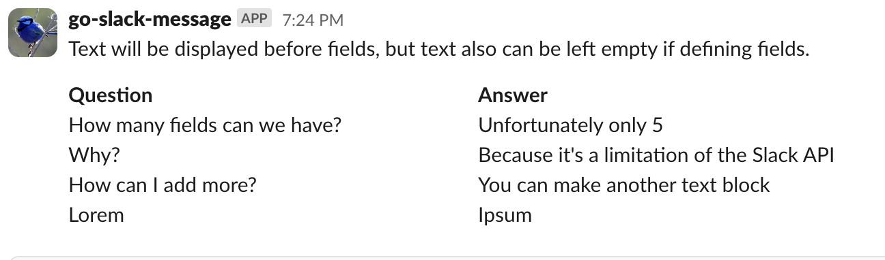
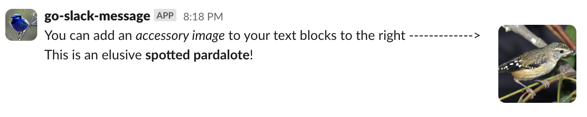

# go-slack-message

A simple slack message builder for Go using webhooks.  
Uses Slack Blocks instead of the legacy attachments format.

# Usage
## Building a message:

```go
import "github.com/AdosH1/go-slack-message"

message := slack.Message()

message.Add(
    slack.Header("This is a Header"),
    slack.Text("*Text* is _basic markdown_"),
    slack.Divider(),
    slack.Image("<IMAGE_URL>", "<ALT_TEXT>"),
)

err := slack.Send("<SLACK_HOOK_URL>", message)
if err != nil {
    // handle error
}
```
### Output:


## Using fields (or columns):
```go
message.Add(
		slack.Text("Text will be displayed before fields, but text also can be left empty if defining fields."). 
			AddField("*Question*", "*Answer*").
			AddField("How many fields can we have?", "Unfortunately only 5").
			AddField("Why?", "Because it's a limitation of the Slack API").
			AddField("How can I add more?", "You can make another text block").
			AddField("Lorem", "Ipsum"),
	)
```
### Output:



## Using a text accessory:
```go
message.Add(
    slack.Text("You can add an _accessory image_ to your text blocks to the right -------------> \nThis is an elusive *spotted pardalote*!")
        .AddAccessory(slack.Image("<IMAGE_URL>", "<ALT_TEXT>")),
)
```
### Output:


# License
Licensed under the Apache License, Version 2.0: http://www.apache.org/licenses/LICENSE-2.0
