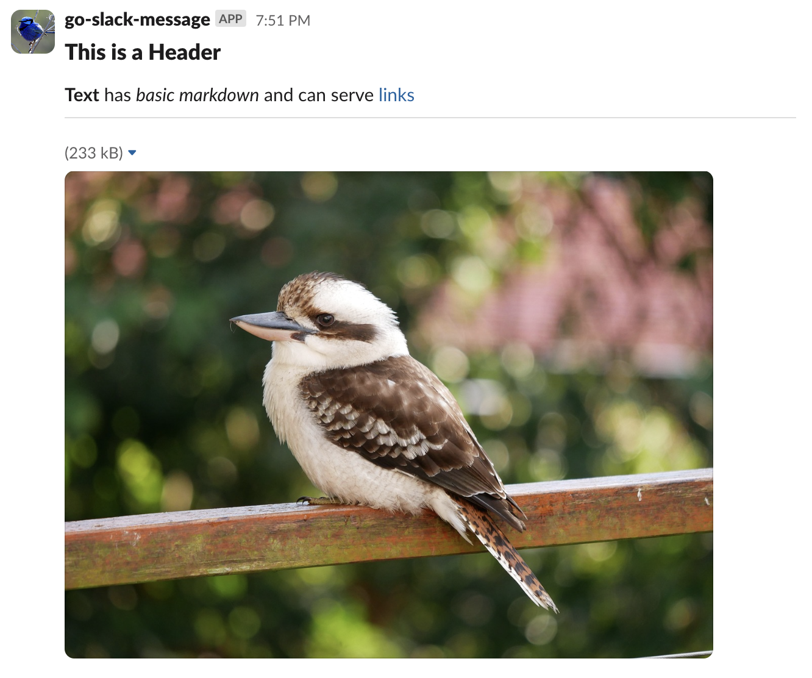
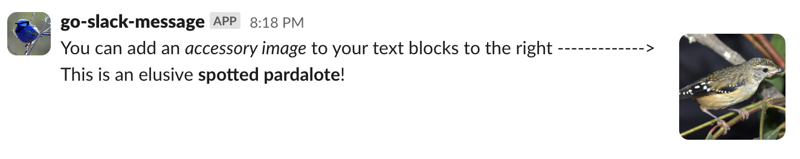

# go-slack-message

A simple slack message builder for Go using webhooks.  
Uses Slack Blocks instead of the legacy attachments format.

## Usage
### Building a message:

```go
import "github.com/AdosH1/go-slack-message"

message := slack.Message()

message.Add(
    slack.Header("This is a Header"),
    slack.Text("*Text* is _basic markdown_"),
    slack.Divider(),
    slack.Image("<IMAGE_URL>", "<ALT_TEXT>"),
)

err := slack.Send("<SLACK_HOOK_URL>", message)
if err != nil {
    // handle error
}
```
### Output:



### Using a text accessory:
```go
message.Add(
    slack.Text("You can add an _accessory image_ to your text blocks to the right -------------> \nThis is an elusive *spotted pardalote*!")
        .Add(slack.Image("<IMAGE_URL>", "<ALT_TEXT>")),
)
```
### Output:


## License
Licensed under the Apache License, Version 2.0: http://www.apache.org/licenses/LICENSE-2.0
